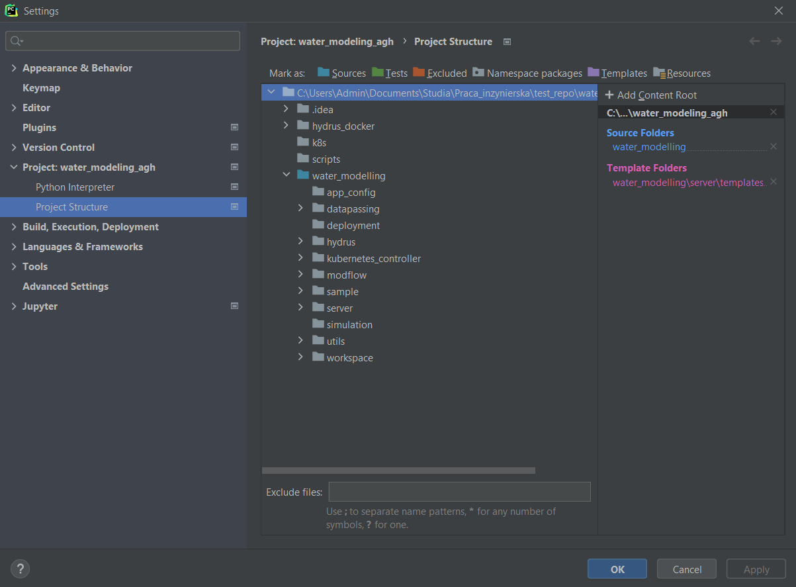
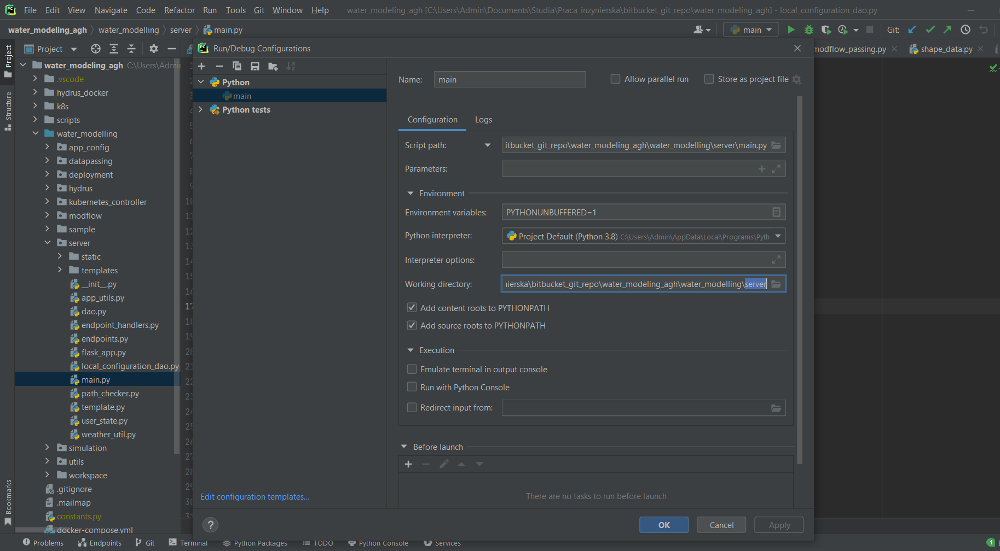

# Hydrus-Modflow Synergy Engine - AGH WATER MODELING
This repository is an engineering project that is also a part of WATERLINE project

## Welcome to the main branch
This branch serves as a repository for common components that are used by every deployment. 
So far we have 3 deployments:
* `desktop`
* `docker`
* `kubernetes`

These versions of application are located on the branches with same name as deployment name.
Each branch has been preconfigured in the file `water_modelling/app_config/deployment_config.py`
to ease testing, launching and mitigate problem with changing deployment config while committing 
to one branch (thus we split master into 3 deployment branches).

#### Important: For application to run properly, it is required to have *cookies* enabled in the web browser.

### Assumed workflow
* if a new feature relates to every application deployment:
  + create a Pull Request to `master`
  + after merging it, rebase other branches to `master`  - while on another branch,
  use `git fetch origin master:master` and then `git rebase master`
* if a new feature relates to two deployments - create two Pull Requests to each branch
* if a new feature relates to only one deployment - create Pull Request to the deployment's branch

More detailed README are located on the deployments' branches.
### Important
* sample projects are located in folder `sample`
* TESTS SHOULD NOT BE RUN ON PROJECT FROM `sample` FOLDER
* instead, they should be copied to new folder `tests` using scripts
* copy sample projects (please refer to the comments in the scripts):
    + Linux script: scripts/copy_projects.sh (suggested)
    + Windows 10 script: scripts/copy_projects.ps (requires enabled Powershell scripts)

### Environment Configuration For Developers
Application was tested on two Python versions: 3.8 and 3.9. 
#### Pycharm configuration
It is necessary to set **water_modelling** directory as **Source** in project settings.

#### Line Separators
Additional changes apply to line separators. Due to some .sh scrips, they need to be set to LF. 
Those files are prepared for Docker and Kubernetes versions running on linux os. Click
[here](https://www.jetbrains.com/help/idea/configuring-line-endings-and-line-separators.html) for further instruction.
#### Run/Debug Configuration
Provide correct main.py *Run and Debug Configuration* as presented below.


### Repository structure
* **hydrus_docker** - folder with data related to hydrus docker image created by us (hydrus executable compiled
from this [repository](https://github.com/AgriHarmony/HYDRUS-1-D-gfortran)
* **k8s** - .yaml kubernetes manifests related to kubernetes deployment, contains also debug manifests
* **scripts** - bash and PowerShell (not recommended) scripts for building and pushing docker images as well 
as for creating test data inside `water_modelling`
* **water_modelling** - main application
  + `app_config` - module containing deployment settings, modified on each deployment's branch
  + `datapassing` - module containing logic related to passing output from the Hydrus simulation 
  as input to the Modflow simulation 
  + `deployment` - module with deployers for each deployment version (desktop, docker, kubernetes)
  + `hydrus` - module with logic related to launching Hydrus simulations
  + `kubernetes_controller` - module with logic related to monitoring kubernetes jobs (simulations are 
  launched as kubernetes jobs inside the cluster)
  + `modflow` - module with logic related to launching Modflow simulations
  + `sample` - sample data meant to be copied and used for tests (there is a script that makes a `tests` folder 
  with content from `sample`)
  + `server` - module with web application components (endpoints, states, page templates and their javascript
  functionalities)
  + `simulation` - module related to launching simulation (hydrus -> data passing -> modflow)
  + `workspace` - necessary folder where all created projects is stored (content is ignored by `.gitignore`)

### Simulation input files
#### Upload Modflow, Hydrus models
It is necessary to upload a model in a correct archive structure.
You need to provide it in a **.zip archive, with the model files placed directly in the root**.
#### Upload Weather Data
It is optional to modify a hydrus model with meteorological data. 
You have to create a **.csv file with correct columns** and values:
* `Date` - date in format m/d/yyy (US format)
* `Longitude` - longitude in Decimal Degrees (DD) format
* `Latitude` - latitude in Decimal Degrees (DD) format
* `Elevation` - elevation over the sea level (altitude) in meters
* `Max Temperature` - maximum temperature in Celsius Degrees
* `Min Temperature` - minimum temperature in Celsius Degrees
* `Precipitation` - precipitation in the same length unit as used in the Hydrus model for example meters
* `Wind` - wind in km/day
* `Relative Humidity` - relative humidity in percentages
* `Solar` - solar radiation in MJ/m2

To obtain data you can check out 
[Global Weather Data for SWAT](https://globalweather.tamu.edu) and adjust it to the correct format of your Hydrus model.

[Example weather file](water_modelling/sample/weather_data/weatherdata.csv)

### Simulation results
##### Archive Structure
```
├── hydrus
│   ├── hydrus_model_name_01
│   |   └── ...
|   └── hydrus_model_name_02
│       └── ...
├── modflow
│   ├── modflow_model_name
│   |   └── ...
│   └── results.json
└── project_name.json
```

##### Project metadata - *[project_name.json]*
```json
{
    "name": "Project_01",           // name of the project
    "lat": "12.12",                 // modflow model top right corner latitude
    "long": "13.13",                // modflow model top right corner longitude
    "start_date": "2001-01-12",     // modflow model start date
    "end_date": "2002-02-03",       // modlow model end date 
    "spin_up": "2",                 // hydrus spin-up in days
    "rows": 5,                      // modflow model rows count
    "cols": 5,                      // modflow model columns count
    "grid_unit": "meters",          // modflow model length unit
    "row_cells": [100.0, 100.0, 100.0, 100.0, 100.0],   // modflow model cell width along rows (given in the grid unit)
    "col_cells": [100.0, 100.0, 100.0, 100.0, 100.0],   // modflow model cell width along columns (given in the grid unit)
    "modflow_model": "project_01_modflow",              // modflow model name
    "hydrus_models": ["project_01_hydrus", "project_02_hydrus"]   // names of the hydrus models
}
```

##### Modflow simulation results - *[results.json]*
```
Contents of 4 dimentional array - modflow_output[stress_period][layer][row][col]
ex. [
      [
        [ 
          [0.1, 0.5, 0.1], 
          [0.1, 0.5, 0.1] 
        ],
        [ 
          [0.1, 0.5, 0.1],
          [0.1, 0.5, 0.1] 
        ]
      ]
    ] (1 stress period, 2 layers, 2 rows, 3 columns)
```